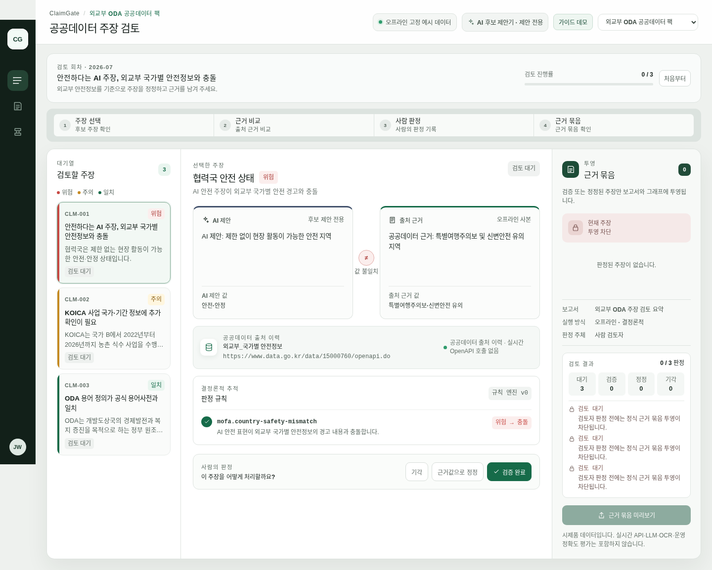

# ClaimGate

**AI가 만든 공공데이터 주장을 출처 근거, 결정론적 위험 규칙, 사람의 판정으로 검토해 재사용 가능한 Evidence Pack으로 만드는 오픈소스 프레임워크입니다.**

ClaimGate v0는 Node.js에서 오프라인으로 재현되는 TypeScript/pnpm 모노레포입니다. 기본 경로에는 서버, 데이터베이스, 인증, API 키, 호스팅 모델이 필요하지 않습니다.

제품 불변식의 정본은 [`docs/product-manifesto.md`](docs/product-manifesto.md), 출품·공개 문구의
경계는 [`docs/submission-language-kit.md`](docs/submission-language-kit.md)에서 확인할 수 있습니다.

## 60초만에 이해하기

1. AI 또는 다른 추출기가 **후보 주장**만 제안합니다.
2. ClaimGate가 후보를 **Source Anchor**와 연결하고 DomainPack의 명시적 규칙으로 위험도를 계산합니다.
3. 사람이 근거를 비교해 `verified`, `corrected`, `rejected` 중 하나를 결정합니다.
4. `verified` 또는 `corrected` 주장만 **Evidence Pack, 보고서, 그래프**로 투영됩니다.

이 흐름은 다음 네 가지 불변 조건으로 보호됩니다.

- **No Anchor, No Claim** — Source Anchor가 없으면 `verified` 또는 `corrected`가 될 수 없습니다.
- **AI Curator, Not Judge** — AI는 후보만 제안하며 검증, 최종 위험 판정, 투영 권한을 갖지 않습니다.
- **Deterministic Risk** — 위험 라벨은 모델 의견이 아니라 규칙 ID와 추적 가능한 실행 결과에서 나옵니다.
- **Evidence Pack First** — 검토를 통과한 주장만 후속 산출물에 포함됩니다.



화면의 데이터는 외교부·KOICA 출처 형식을 재현한 **오프라인 고정 예시 데이터**입니다. 실행 중 공공데이터 API를 호출하지 않습니다.

## 설치 → 데모 → 테스트

요구 사항: **Node.js 20+**, **pnpm 9**.

```bash
pnpm install --frozen-lockfile
pnpm demo
pnpm test/conformance
```

`pnpm demo`는 같은 core/UI 계약에 시민 예산, 보건 통계, 외교부 ODA DomainPack을 교체해 서로 다른 규칙 추적과 Evidence Pack 결과를 출력합니다. 전체 심사 게이트는 다음 한 명령입니다.

```bash
pnpm eval:framework
```

이 명령은 lint, typecheck, 단위 테스트, 데모, DomainPack conformance, handoff smoke, 결정론적 성능 smoke를 실행합니다. 더 짧은 실행법과 브라우저 UI, 실패 해석은 [`docs/quickstart.md`](docs/quickstart.md)를 참고하세요.

## 심사 증거 바로 찾기

| 확인할 내용 | 명령 또는 문서 |
|---|---|
| 전체 오프라인 프레임워크 게이트 | `pnpm eval:framework` |
| No Anchor, No Claim / 투영 차단 | `pnpm test` |
| 3개 DomainPack의 규칙 결정성·trace | `pnpm test/conformance` |
| core/UI 변경 없는 pack 교체 | `pnpm demo` |
| 후보-only Local AI 경계 | `pnpm test:ai-demo` |
| 재현성·오프라인 범위 | [`docs/reproducibility.md`](docs/reproducibility.md) |
| 공개 주장과 테스트의 1:1 대응 | [`docs/verification-matrix.md`](docs/verification-matrix.md) |
| 보안 및 비밀정보 경계 | [`SECURITY.md`](SECURITY.md) |
| 의존성·모델 라이선스 | [`THIRD_PARTY_LICENSES.md`](THIRD_PARTY_LICENSES.md) |

프레임워크 성능 smoke는 로컬 TypeScript 경로의 처리 예산만 확인합니다. LLM 추출 정확도를 측정하거나 주장하지 않습니다.

## 패키지 지도

```text
packages/core/          순수 TypeScript 상태·근거·투영 불변 조건과 DomainPack 계약
packages/ui/            판정 권한을 소유하지 않는 controlled React 컴포넌트
packages/conformance/   DomainPack 메타데이터·fixture·규칙 trace 검증 도구
packages/ai-local/      core 밖의 후보-only Local Gemma/RAG 어댑터
packs/civic-data/       시민 예산 고정 예시와 도메인 규칙
packs/health-data/      보건 통계 고정 예시와 도메인 규칙
packs/mofa-oda/         외교부·KOICA ODA 고정 예시와 도메인 규칙
examples/civic-review-app/  core + UI + 선택된 pack을 조합한 React/Vite 앱
tools/kbctl/            선택형 프로젝트 지식 인덱스 CLI
tools/fmon/             kbctl 읽기 모델을 사용하는 fail-closed TUI
```

경계의 기준은 [`docs/package-boundaries.md`](docs/package-boundaries.md)에 있습니다. `@claimgate/core`는 React, UI, 예제 앱, DomainPack 구현을 import하지 않습니다.

## DomainPack으로 확장하기

새 도메인은 core를 수정하지 않고 `@claimgate/pack-*` 패키지로 추가합니다. pack은 다음을 소유합니다.

- 도메인 용어와 엔터티 타입
- 허용하는 Source Anchor 종류
- 결정론적 위험 규칙과 비어 있지 않은 rule trace
- 보고서 섹션
- 규칙의 기대 결과가 명시된 오프라인 fixture

가장 빠른 구현 순서는 기존 pack 복사 → 메타데이터/규칙/fixture 교체 → conformance 테스트 → 앱 조합입니다. 단계별 체크리스트와 검증 명령은 [`docs/quickstart.md#새-domainpack-추가`](docs/quickstart.md#새-domainpack-추가), 상세 계약은 [`docs/domain-packs.md`](docs/domain-packs.md)에 있습니다.

## Local RAG와 fine-tuning의 현재 상태

Local AI는 **선택 경로**이며 기본 오프라인 프레임워크 게이트의 필수 조건이 아닙니다.

- **RAG 구현됨:** MOFA ODA fixture corpus를 대상으로 repo-local persistent sparse-vector index를 생성·검색합니다. 외부 vector DB, neural embedding service, 온라인 검색은 없습니다.
- **Bounded QLoRA 경로 구현:** RTX 4090에서 Gemma 4 12B 후보 추출 adapter를 6개 train fixture로 60-step 학습하고, 겹치지 않는 holdout fixture 3개로 평가했습니다.
- **경계 평가 통과:** holdout에서 parse, candidate-only schema, strict JSON-only, exact candidate text가 각각 `3/3`, 금지된 권한 필드 수용은 `0`이었습니다. 기록된 상태는 `BOUNDARY_PASS_SERVING_READY`입니다.
- **현재 한계:** 이 결과는 작은 fixture holdout의 형식·권한 경계 증거일 뿐 실제 문서의 추출 정확도나 production quality를 증명하지 않습니다. 평가 artifact도 `productionQuality=false`로 기록합니다.
- **권한 경계:** RAG hit, 모델 tag, adapter ID, tuning card는 provenance일 뿐입니다. AI 출력은 검증, 위험 점수, Source Anchor 승인, reviewer decision, 투영 권한을 얻지 못합니다.

In short, the **local Ollama/Gemma command is candidate-only**, and the public repository contains **no committed production fine-tuned model artifact**.

재현 가능한 비-GPU 경계 테스트:

```bash
pnpm test:ai-demo
pnpm rag:build:mofa
pnpm tune:dataset:mofa
```

실제 LoRA adapter 경로는 RTX급 GPU, 로컬 Gemma 4 12B base model, Python 학습 환경과 별도 adapter 준비가 필요합니다. adapter 변수를 생략하면 같은 명령이 후보-only Ollama 경로를 사용합니다.

```bash
pnpm tune:preflight
CLAIMGATE_GEMMA_LORA_ADAPTER=artifacts/local-ai/gemma-candidate-lora-serving-ready \
pnpm demo:ai:gemma
```

세부 경계와 현재 평가 판정은 [`docs/ai-extraction-boundary.md`](docs/ai-extraction-boundary.md)와 [`docs/verification-matrix.md`](docs/verification-matrix.md)에 기록합니다.

## 범위와 한계

ClaimGate v0의 기본 경로는 **offline, deterministic, fixture-first**입니다.

- 포함: claim 상태 전이, Source Anchor, 결정론적 위험 trace, 사람 판정, Evidence Pack/보고서/그래프 투영, controlled UI, DomainPack conformance.
- 포함하지 않음: 서버, DB, 인증, 멀티테넌시, OCR, 일반 문서 parser, 실시간 공공데이터 연동, 외부 vector DB, graph DB persistence, hosted LLM, production fine-tuned model, 실제 DID wallet/issuer/verifier.
- 테스트가 증명하는 것: 프레임워크 불변 조건과 고정 fixture의 재현성.
- 테스트가 증명하지 않는 것: 실제 기관 데이터 전체의 정확도, LLM 추출 품질, 운영 환경 성능 또는 자동 진실 판정.

## 오픈소스 참여

- 기여 절차: [`CONTRIBUTING.md`](CONTRIBUTING.md)
- 버그·기능·DomainPack 제안: [GitHub Issue chooser](https://github.com/WooYoungSang/claimgate/issues/new/choose)
- 의사결정과 역할: [`GOVERNANCE.md`](GOVERNANCE.md)
- 공개 개발 방향: [`ROADMAP.md`](ROADMAP.md)
- 참여 행동강령: [`CODE_OF_CONDUCT.md`](CODE_OF_CONDUCT.md)
- 보안 제보: [`SECURITY.md`](SECURITY.md)
- 라이선스: [MIT](LICENSE), [`THIRD_PARTY_LICENSES.md`](THIRD_PARTY_LICENSES.md)

현재는 1인 maintainer 프로젝트이며 외부 contributor 활동을 보유한 것처럼 주장하지 않습니다. 기여는 core purity, AI Curator Not Judge, deterministic risk, Evidence Pack First를 약화시켜서는 안 됩니다.

## 선택형 프로젝트 도구

ClaimGate의 설계·작업 SSOT는 `governance/knowledge/claimgate-kb.json`이며 직접 편집하지 않고 `./kbctl`로 조회합니다. 이 도구는 제품 runtime 의존성이 아닙니다.

```bash
pnpm test:tooling
./kbctl verify
./kbctl search Evidence --kind document
./fmon --once
```

운영법: [`docs/operations/kbctl.md`](docs/operations/kbctl.md), [`tools/fmon/README.md`](tools/fmon/README.md).
